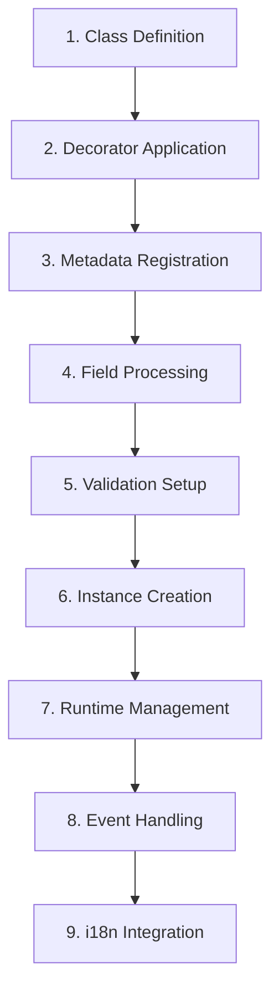

# 📖 SESSION 1.1: @resk/core Resource Architecture - Complete Documentation

> **Generated from source code analysis** - Based on actual implementation in `/packages/resk-core/src/`

## 🏗️ Resource Architecture Overview

### 🎯 Core Philosophy
Reskit's resource architecture is built on the principle that **everything is a resource**. A resource represents any entity in your application - from database models to UI components to business logic. The framework uses TypeScript decorators and reflection to create a powerful, type-safe system for defining and managing these resources.

### 🔄 Resource Lifecycle



#### **1. Class Definition**
You start by defining a TypeScript class that extends the base `Resource` class:

```typescript
import { Resource } from '@resk/core';

export class User extends Resource {
  // Your resource properties will be defined here
}
```

#### **2. Decorator Application**
Use the `@Field` decorator to define properties with metadata:

```typescript
import { Resource, Field } from '@resk/core';

export class User extends Resource {
  @Field({ type: 'string', required: true, minLength: 2, maxLength: 50 })
  firstName: string;
  
  @Field({ type: 'string', required: true, minLength: 2, maxLength: 50 })
  lastName: string;
  
  @Field({ type: 'string', required: true, unique: true })
  email: string;
}
```

#### **3. Metadata Registration**
The framework automatically registers metadata using Reflect Metadata API:

```typescript
// This happens automatically behind the scenes
const fieldsMetaData = Symbol("fieldsResourcesMetadata");
Reflect.defineMetadata(fieldsMetaData, fieldDefinitions, target);
```

#### **4. Field Processing**
The system processes each field and infers types automatically:

```typescript
// From the source code analysis:
const reflecType = String(Reflect.getMetadata('design:type', target, propertyKey)?.name).toLowerCase();

// Auto-assigns type if not specified
if (!options.type && ['string', 'number', 'boolean', 'date'].includes(reflecType)) {
  options.type = reflecType;
}
```

#### **5. Validation Setup**
Validation rules are automatically configured based on field definitions.

#### **6. Instance Creation**
When you create an instance, the resource initializes with:
- Event handling capabilities
- i18n support
- Observable patterns
- Automatic field validation

#### **7. Runtime Management**
Resources are managed through the `ResourcesManager` which handles:
- Resource registration
- Field retrieval
- Event broadcasting
- Lifecycle management

#### **8. Event Handling**
Resources extend `ObservableClass` providing event capabilities:

```typescript
// Resources can emit and listen to events
resource.on('dataChanged', (data) => {
  console.log('Resource data changed:', data);
});

resource.emit('dataChanged', newData);
```

#### **9. i18n Integration**
Automatic internationalization support:

```typescript
// Resources automatically listen to locale changes
private _onLocaleChangeListener = i18n.on("locale-changed", this.onI18nChange.bind(this));
```

---

## 🏛️ Core Architecture Components

### 1. **Base Resource Class**

The `Resource` class is the foundation of the entire system:

```typescript
export abstract class Resource<
  DataType extends IResourceData = any,
  PrimaryKeyType extends IResourcePrimaryKey = IResourcePrimaryKey,
  EventType extends Partial<IResourceDefaultEvent> = IResourceDefaultEvent
> extends ObservableClass<EventType> {
  
  // Core properties
  name?: IResourceName;
  label?: string;
  title?: string;
  tooltip?: string;
  
  // Lifecycle methods
  constructor() {
    super();
    this._onDictionaryChangedListener = i18n.on("translations-changed", this.onI18nChange.bind(this));
    this._onLocaleChangeListener = i18n.on("locale-changed", this.onI18nChange.bind(this));
    this.init();
  }
  
  // Abstract methods to be implemented
  abstract init(): void;
  
  // Metadata access
  getMetaData(): IResource<DataType> {
    return Object.assign({}, Reflect.getMetadata(ResourcesManager.resourceMetaData, this.constructor));
  }
}
```

### 2. **Field System**

#### **Field Decorator**
The `@Field` decorator is the core mechanism for defining resource properties:

```typescript
export function Field<T extends IFieldType = IFieldType>(options: IField<T>): PropertyDecorator {
  return function (target: any, propertyKey: string | symbol) {
    // Get existing fields metadata
    const fields = Object.assign({}, Reflect.getMetadata(fieldsMetaData, target) || {});
    
    // Auto-detect type from TypeScript reflection
    const reflecType = String(Reflect.getMetadata('design:type', target, propertyKey)?.name).toLowerCase();
    
    // Auto-assign type if not specified
    if (!options.type && ['string', 'number', 'boolean', 'date'].includes(reflecType)) {
      options.type = reflecType;
    }
    
    // Store field metadata
    fields[propertyKey] = { name: propertyKey, ...options };
    
    // Register with Reflect Metadata
    Reflect.defineMetadata(fieldsMetaData, fields, target);
  };
}
```

#### **Field Retrieval**
Access field metadata at runtime:

```typescript
// Get fields from a class
export function getFieldsFromTarget(target: IClassConstructor): Record<string, IField> {
  return Object.assign({}, Reflect.getMetadata(fieldsMetaData, target.prototype));
}

// Get fields from an instance
export function getFields<T extends IClassConstructor = any>(instance: InstanceType<T>): Record<string, IField> {
  return Object.assign({}, Reflect.getMetadata(fieldsMetaData, instance.constructor));
}
```

### 3. **Type System**

#### **Field Types**
The framework provides a flexible type system through `IFieldMap`:

```typescript
// Base field interface
export interface IFieldBase<FieldType extends IFieldType = IFieldType> {
  type: FieldType;
  name?: string;
  label?: string;
  required?: boolean;
  unique?: boolean;
  readOnly?: boolean;
  disabled?: boolean;
  visible?: boolean;
  primaryKey?: boolean;
  minLength?: number;
  maxLength?: number;
  length?: number;
  // ... many more properties
}

// Extensible field map
export interface IFieldMap {
  unknown: IFieldBase<"unknown">;
  // Add more field types through module augmentation
}

// Type-safe field type union
export type IFieldType = keyof IFieldMap;
```

#### **Type Safety**
Complete TypeScript support with automatic inference:

```typescript
// TypeScript automatically infers the correct type
@Field({ type: 'string', minLength: 3 })
username: string; // ✅ Type matches

@Field({ type: 'number', min: 0 })
age: number; // ✅ Type matches

// TypeScript would error on mismatched types
@Field({ type: 'string' })
invalidAge: number; // ❌ TypeScript error
```

### 4. **Resource Registration System**

#### **Metadata Keys**
The system uses Symbols for metadata storage:

```typescript
const resourcesMetaDataKey = Symbol('resources');
const resourcesClassNameMetaData = Symbol('resourceFromClassName');
const fieldsMetaData = Symbol("fieldsResourcesMetadata");
```

#### **ResourcesManager**
Central management of all resources:

```typescript
export class ResourcesManager {
  static resourceMetaData = resourcesMetaDataKey;
  
  // Register a resource
  static register<T extends Resource>(resourceClass: IClassConstructor<T>) {
    // Registration logic
  }
  
  // Get registered resources
  static getResources(): Record<string, IClassConstructor<Resource>> {
    // Retrieval logic
  }
}
```

---

## 🔧 Advanced Configuration

### 1. **Custom Property Decorators**

Create reusable property decorators:

```typescript
import { createPropertyDecorator } from '@resk/core';

// Create a custom decorator for required string fields
export const RequiredString = createPropertyDecorator(
  'requiredString',
  (existingMetaData, allMetadata, target, propertyKey) => ({
    type: 'string',
    required: true,
    minLength: 1,
    ...existingMetaData
  })
);

// Usage
export class User extends Resource {
  @RequiredString({ maxLength: 50 })
  firstName: string;
}
```

### 2. **Type Registry System**

Register custom renderers for different contexts:

```typescript
import { TypeRegistry } from '@resk/core';

// Register a custom number renderer for datagrids
TypeRegistry.register('number', 'datagridCell', (value: number) => {
  return \`<div class="cell number">\${value.toLocaleString()}</div>\`;
});

// Register a custom date renderer for forms
TypeRegistry.register('date', 'formField', (value: Date) => {
  return \`<input type="date" value="\${value.toISOString().split('T')[0]}" />\`;
});
```

### 3. **Resource Events**

Handle resource lifecycle events:

```typescript
export class User extends Resource {
  init() {
    // Setup event listeners
    this.on('beforeCreate', this.validateBeforeCreate);
    this.on('afterUpdate', this.sendNotification);
  }
  
  private validateBeforeCreate = (data: any) => {
    console.log('Validating user before creation:', data);
  };
  
  private sendNotification = (data: any) => {
    console.log('User updated, sending notification:', data);
  };
}
```

### 4. **i18n Integration**

Automatic internationalization support:

```typescript
export class User extends Resource {
  // The resource automatically handles locale changes
  private onI18nChange() {
    // React to language changes
    this.emit('localeChanged', i18n.currentLocale());
  }
  
  // Get localized labels
  getLabel(): string {
    return i18n.t(\`resources.\${this.name}.label\`, { defaultValue: this.label });
  }
  
  getTitle(): string {
    return i18n.t(\`resources.\${this.name}.title\`, { defaultValue: this.title });
  }
}
```

---

## 🚀 Practical Examples

### 1. **Simple Resource Definition**

```typescript
import { Resource, Field } from '@resk/core';

export class Product extends Resource {
  @Field({ type: 'string', required: true, maxLength: 100 })
  name: string;
  
  @Field({ type: 'string', maxLength: 500 })
  description: string;
  
  @Field({ type: 'number', required: true, min: 0 })
  price: number;
  
  @Field({ type: 'string', required: true })
  category: string;
  
  @Field({ type: 'boolean', default: true })
  active: boolean;
  
  init() {
    console.log('Product resource initialized');
  }
}
```

### 2. **Complex Resource with Relationships**

```typescript
import { Resource, Field } from '@resk/core';

export class Order extends Resource {
  @Field({ type: 'string', primaryKey: true })
  id: string;
  
  @Field({ type: 'string', required: true })
  customerId: string;
  
  @Field({ type: 'number', required: true, min: 0 })
  totalAmount: number;
  
  @Field({ type: 'string', required: true })
  status: 'pending' | 'confirmed' | 'shipped' | 'delivered';
  
  @Field({ type: 'date', required: true })
  orderDate: Date;
  
  @Field({ type: 'date' })
  shippedDate?: Date;
  
  init() {
    // Setup validation
    this.on('beforeSave', this.validateOrder);
  }
  
  private validateOrder = (data: any) => {
    if (data.status === 'shipped' && !data.shippedDate) {
      throw new Error('Shipped date is required when status is shipped');
    }
  };
}
```

### 3. **Getting Field Information at Runtime**

```typescript
import { getFields, getFieldsFromTarget } from '@resk/core';

// Get fields from class
const productFields = getFieldsFromTarget(Product);
console.log(productFields);
// Output: {
//   name: { type: 'string', required: true, maxLength: 100, name: 'name' },
//   description: { type: 'string', maxLength: 500, name: 'description' },
//   price: { type: 'number', required: true, min: 0, name: 'price' },
//   // ...
// }

// Get fields from instance
const product = new Product();
const fields = getFields(product);
console.log(fields); // Same output as above
```

---

## ⚡ Performance Considerations

### 1. **Metadata Storage**
- Metadata is stored using Reflect Metadata API
- Efficient Symbol-based keys prevent naming conflicts
- Metadata is cached at the class level, not instance level

### 2. **Memory Management**
- Resources automatically clean up event listeners in destructor
- i18n listeners are properly removed to prevent memory leaks
- Observable patterns use weak references where possible

### 3. **Type Inference**
- TypeScript reflection happens only during decoration
- Runtime type checking is minimal and optimized
- Field validation is lazy-loaded when needed

---

## 🔍 Best Practices

### 1. **Resource Definition**
- Always extend the base `Resource` class
- Use meaningful resource names
- Implement the `init()` method for setup logic
- Keep resources focused on a single responsibility

### 2. **Field Decoration**
- Use specific field types when possible
- Always specify required fields explicitly
- Add validation constraints (min, max, length, etc.)
- Use meaningful field names that match your data model

### 3. **Type Safety**
- Leverage TypeScript's strict mode
- Use generic type parameters for better type inference
- Extend `IFieldMap` for custom field types
- Always match decorator types with property types

### 4. **Event Handling**
- Clean up event listeners in resource cleanup
- Use typed event interfaces for better development experience
- Keep event handlers focused and lightweight
- Document event contracts clearly

---

## 🎯 Next Steps

This concludes Session 1.1 on Resource Architecture. The next sessions will cover:

- **Session 1.2**: Complete Field Types Reference
- **Session 1.3**: Resource Relationships and Advanced Patterns
- **Session 2.1**: @resk/nativewind Component System
- **Session 3.1**: @resk/nest Auto-Generated APIs

**Ready for Session 1.2?** Let me know and I'll create comprehensive documentation for all available field types and their usage patterns!
