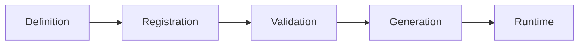

# 📚 Reskit Framework - Complete User Guide

> **Reskit** is an innovative TypeScript framework that empowers developers to build applications with a fully decorator-based architecture for efficient resource management. Write less, achieve more.

## 📋 Table of Contents

### 🚀 [Getting Started](#getting-started)
- [Overview & Philosophy](#overview--philosophy)
- [Installation](#installation)
- [Quick Start](#quick-start)
- [Project Setup](#project-setup)

### 🏗️ [Framework Architecture](#framework-architecture)
- [Core Concepts](#core-concepts)
- [Resource-Based Design](#resource-based-design)
- [Decorator System](#decorator-system)
- [Type Safety](#type-safety)

### 📦 [Core Packages](#core-packages)
- [@resk/core - The Foundation](#reskcore---the-foundation)
- [@resk/nativewind - UI Framework](#resknativewind---ui-framework)
- [@resk/nest - Backend Framework](#resknest---backend-framework)
- [@resk/native - React Native Support](#resknative---react-native-support)

### 🔧 [Practical Guides](#practical-guides)
- [Building Your First Resource](#building-your-first-resource)
- [Frontend Development with @resk/nativewind](#frontend-development-with-resknativewind)
- [Backend Development with @resk/nest](#backend-development-with-resknest)
- [Full-Stack Integration](#full-stack-integration)

### 📖 [API Reference](#api-reference)
- [Decorators Reference](#decorators-reference)
- [Field Types](#field-types)
- [Utilities & Helpers](#utilities--helpers)
- [Configuration Options](#configuration-options)

### 🎯 [Best Practices](#best-practices)
- [Code Organization](#code-organization)
- [Performance Optimization](#performance-optimization)
- [Testing Strategies](#testing-strategies)
- [Production Deployment](#production-deployment)

### 🔗 [Examples & Tutorials](#examples--tutorials)
- [Basic Examples](#basic-examples)
- [Advanced Use Cases](#advanced-use-cases)
- [Real-World Projects](#real-world-projects)
- [Migration Guides](#migration-guides)

---

## 🚀 Getting Started

### Overview & Philosophy

Reskit is built on the principle of **"Write Less, Achieve More"**. The framework embraces a resource-oriented architecture where every component of your application is treated as a resource that can be decorated, extended, and managed efficiently.

#### 🎯 Core Philosophy
- **Resource-Centric**: Everything is a resource - from data models to UI components
- **Decorator-Driven**: Use TypeScript decorators to define behavior and properties
- **Type-Safe**: Full TypeScript support with robust type checking
- **Modular**: Pick and choose the packages you need
- **Extensible**: Easy to extend with custom decorators and field types

#### 🌟 Why Choose Reskit?

| Feature | Traditional Approach | Reskit Approach |
|---------|---------------------|-----------------|
| **Code Volume** | Hundreds of lines for basic CRUD | Few decorators and you're done |
| **Type Safety** | Manual type definitions | Automatic type inference |
| **Consistency** | Varies across developers | Enforced patterns |
| **Maintainability** | Complex refactoring | Decorator-based changes |
| **Learning Curve** | Framework-specific APIs | Intuitive decorator syntax |

### Installation

#### Prerequisites
```bash
# Required
Node.js >= 14.0.0
npm >= 6.0.0 or yarn >= 1.22.0
TypeScript >= 4.5.0
```

#### Core Installation
```bash
# Install the core framework
npm install @resk/core reflect-metadata

# For UI development (React/Next.js)
npm install @resk/nativewind

# For backend development (NestJS)
npm install @resk/nest

# For React Native development
npm install @resk/native
```

#### TypeScript Configuration
```json
// tsconfig.json
{
  "compilerOptions": {
    "experimentalDecorators": true,
    "emitDecoratorMetadata": true,
    "strict": true,
    "target": "ES2020",
    "module": "commonjs",
    "lib": ["ES2020"],
    "types": ["reflect-metadata"]
  },
  "include": ["src/**/*"],
  "exclude": ["node_modules", "dist"]
}
```

#### Enable Decorators
```typescript
// main.ts or index.ts (top of file)
import 'reflect-metadata';
```

### Quick Start

Let's build a simple User resource to understand Reskit's power:

```typescript
import 'reflect-metadata';
import { Resource, Field, StringField, EmailField, NumberField } from '@resk/core';

@Resource({
  name: 'User',
  tableName: 'users'
})
export class User {
  @Field({
    primaryKey: true,
    autoIncrement: true
  })
  id: number;

  @StringField({
    required: true,
    minLength: 2,
    maxLength: 50
  })
  firstName: string;

  @StringField({
    required: true,
    minLength: 2,
    maxLength: 50
  })
  lastName: string;

  @EmailField({
    required: true,
    unique: true
  })
  email: string;

  @NumberField({
    min: 18,
    max: 120,
    default: 25
  })
  age: number;
}
```

That's it! With just a few decorators, you've defined:
- ✅ Database schema
- ✅ Validation rules
- ✅ Type definitions
- ✅ API endpoints (with @resk/nest)
- ✅ Form generation (with @resk/nativewind)

### Project Setup

#### 1. Create a New Reskit Project
```bash
# Create project directory
mkdir my-reskit-app
cd my-reskit-app

# Initialize package.json
npm init -y

# Install Reskit
npm install @resk/core @resk/nativewind @resk/nest reflect-metadata
npm install -D typescript @types/node

# Create TypeScript config
npx tsc --init
```

#### 2. Project Structure
```
my-reskit-app/
├── src/
│   ├── resources/          # Resource definitions
│   │   ├── User.ts
│   │   ├── Product.ts
│   │   └── index.ts
│   ├── frontend/           # Frontend components (@resk/nativewind)
│   │   ├── components/
│   │   ├── pages/
│   │   └── app.tsx
│   ├── backend/            # Backend logic (@resk/nest)
│   │   ├── controllers/
│   │   ├── services/
│   │   └── main.ts
│   └── shared/             # Shared utilities
│       ├── types.ts
│       └── constants.ts
├── package.json
├── tsconfig.json
└── README.md
```

---

## 🏗️ Framework Architecture

### Core Concepts

#### 1. Resources
Everything in Reskit is a **Resource**. A resource represents:
- **Data Model**: Database entities, API responses
- **UI Component**: Forms, lists, cards
- **Business Logic**: Services, validators
- **Configuration**: Settings, metadata

#### 2. Decorators
Decorators are the heart of Reskit:
- **@Resource**: Defines a resource class
- **@Field**: Defines resource properties
- **@StringField, @NumberField, @EmailField**: Specific field types
- **@Validator**: Custom validation logic
- **@Transform**: Data transformation
- **@Computed**: Calculated properties

#### 3. Resource Lifecycle


1. **Definition**: Decorators define resource structure
2. **Registration**: Framework registers the resource
3. **Validation**: Schema and rules validation
4. **Generation**: Auto-generation of APIs, forms, etc.
5. **Runtime**: Live resource management

### Resource-Based Design

#### Traditional vs Resource-Based

**Traditional Approach:**
```typescript
// Model definition
interface User {
  id: number;
  name: string;
  email: string;
}

// Validation schema
const userSchema = {
  name: { required: true, minLength: 2 },
  email: { required: true, format: 'email' }
};

// API endpoint
@Controller('/users')
class UserController {
  @Get()
  findAll() { /* implementation */ }
  
  @Post()
  create(@Body() user: User) { /* implementation */ }
}

// Frontend form
const UserForm = () => {
  return (
    <form>
      <input name="name" required />
      <input name="email" type="email" required />
    </form>
  );
};
```

**Reskit Approach:**
```typescript
@Resource({ name: 'User' })
class User {
  @StringField({ required: true, minLength: 2 })
  name: string;
  
  @EmailField({ required: true })
  email: string;
}

// That's it! Auto-generated:
// ✅ API endpoints
// ✅ Validation
// ✅ Forms
// ✅ Type definitions
```

---

## 📦 Core Packages

### @resk/core - The Foundation

The core package provides the fundamental building blocks of the Reskit framework.

#### Key Features:
- 🎯 **Resource Definition**: `@Resource` decorator
- 🔧 **Field Types**: 15+ built-in field types
- ✅ **Validation**: Automatic validation
- 🔄 **Transforms**: Data transformation
- 📊 **Observers**: Reactive programming
- 🌐 **i18n**: Internationalization
- 🛠️ **Utilities**: Helper functions

#### Basic Usage:
```typescript
import { Resource, StringField, NumberField } from '@resk/core';

@Resource()
class Product {
  @StringField({ required: true })
  name: string;
  
  @NumberField({ min: 0 })
  price: number;
}
```

---

## 📝 **Writing Prompts for Continuation**

I've created the foundation of your Reskit user guide. Here are specific prompts for you to help me continue writing each section:

### **Prompt 1: @resk/nativewind - UI Framework**
*"Please provide me with:*
- *Key components and their props*
- *Examples of form generation from resources*
- *Theme system and customization*
- *Integration with Next.js/React*
- *Component composition patterns"*

### **Prompt 2: @resk/nest - Backend Framework**
*"I need information about:*
- *Auto-generated controllers and routes*
- *Database integration (TypeORM, Mongoose)*
- *Authentication and authorization*
- *Middleware and interceptors*
- *API documentation generation"*

### **Prompt 3: Field Types and Decorators**
*"Help me document:*
- *All available field types (@StringField, @NumberField, etc.)*
- *Field options and validation rules*
- *Custom field type creation*
- *Relationship decorators (@OneToMany, @ManyToOne)*
- *Advanced decorator patterns"*

### **Prompt 4: Real-World Examples**
*"I want to include:*
- *E-commerce application example*
- *Blog/CMS example*
- *User management system*
- *API integration patterns*
- *Performance optimization examples"*

### **Prompt 5: Migration and Integration**
*"Please help with:*
- *Migrating from Express to @resk/nest*
- *Integrating with existing React projects*
- *Database migration strategies*
- *Legacy code integration*
- *Gradual adoption patterns"*

### **Prompt 6: Advanced Topics**
*"Cover these advanced topics:*
- *Custom decorators creation*
- *Plugin system and extensions*
- *Performance optimization*
- *Testing strategies*
- *Production deployment*
- *Monitoring and debugging"*

### **Prompt 7: Troubleshooting & FAQ**
*"Include common issues:*
- *TypeScript configuration problems*
- *Decorator registration issues*
- *Build and deployment errors*
- *Performance bottlenecks*
- *Common anti-patterns"*

---

## 🎯 **Next Steps**

Choose which section you'd like me to continue with by using one of the prompts above. I'll expand each section with:

- ✅ **Detailed explanations** with code examples
- ✅ **Step-by-step tutorials** for beginners
- ✅ **Advanced patterns** for experienced developers
- ✅ **Real-world scenarios** and use cases
- ✅ **Best practices** and recommendations
- ✅ **Troubleshooting guides** for common issues

Simply tell me which prompt you'd like to start with, and I'll create comprehensive documentation for that section!
